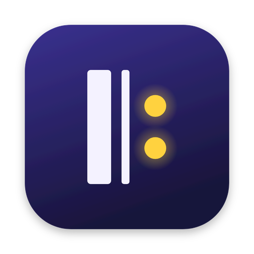
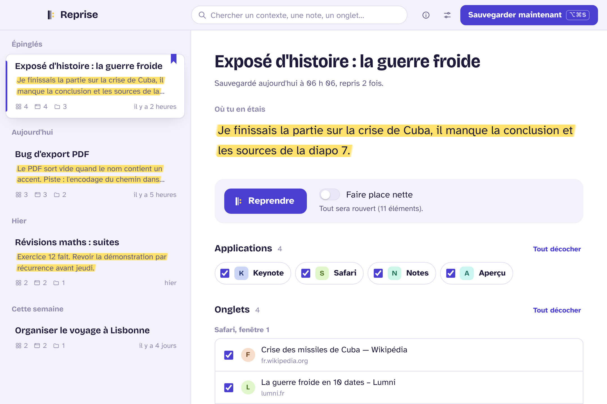
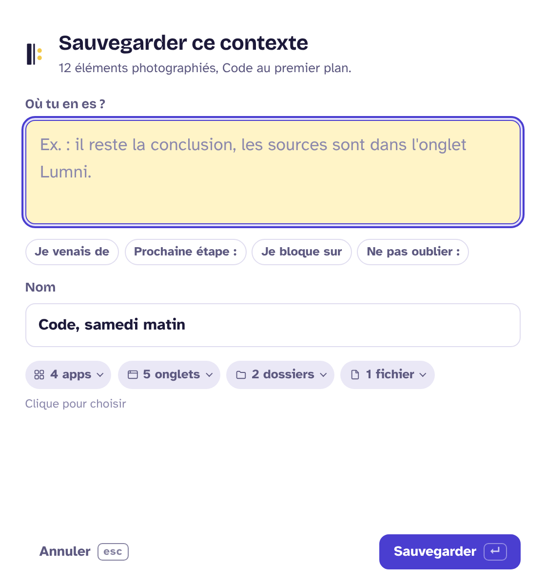
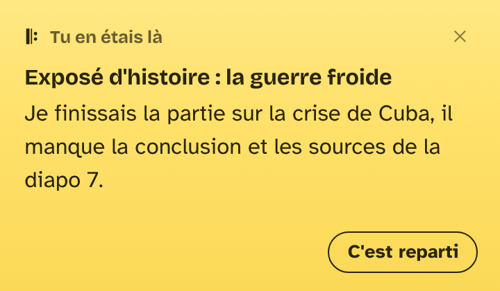

<p align="center">
  
</p>

<h1 align="center">Reprise</h1>

<p align="center">
  <strong>Sauvegarde ton contexte de travail en un raccourci. Reprends-le en un clic.</strong><br>
  Pour Mac Apple Silicon (M1 et suivants) · gratuit · open source · tout reste sur ton Mac
</p>

<p align="center">
  <a href="https://github.com/RenzVASA/reprise/releases/latest"><b>Télécharger la dernière version</b></a>
</p>

<p align="center">
  
</p>

---

## Le problème

Tu travailles sur un truc. Trois fenêtres de navigateur, douze onglets, un dossier ouvert dans le Finder, un fichier dans ton éditeur, une note à moitié écrite. Puis on t'interrompt : une pause, un cours, un autre projet, le lendemain.

Quand tu reviens, tout est mélangé, et tu perds vingt minutes à te souvenir de ce que tu faisais.

## Ce que fait Reprise

1. **Tu appuies sur ⌥⌘S.** Reprise photographie tes apps ouvertes, les onglets de tes navigateurs, tes dossiers du Finder et les fichiers ouverts dans tes apps.
2. **Tu écris une phrase : « où j'en étais ».** C'est elle qui fait toute la différence le lendemain. Des débuts de phrase sont proposés pour ne jamais rester bloqué devant une page blanche.
3. **Plus tard, tu cliques sur « Reprendre ».** Tout se rouvre, chaque fenêtre à sa place et à sa taille, et ta phrase s'affiche sur un post-it en haut de l'écran.

Et si tu oublies d'appuyer sur ⌥⌘S ? Le **filet de sécurité** s'en occupe : Reprise sauvegarde toute seule quand tu verrouilles ton Mac, qu'il se met en veille ou que tu t'absentes. En revenant, un post-it te demande : « Tu étais sur… on reprend ? »

<p align="center">
  
  &nbsp;&nbsp;
  
</p>

## Pensé pour les gens qui sautent d'une tâche à l'autre

Reprise est utile à tout le monde, mais il a été pensé d'abord pour les personnes neuroatypiques (TDAH, troubles dys, autisme…) pour qui « revenir dedans » après une interruption coûte cher.

- **Un seul geste à retenir.** Le raccourci marche depuis n'importe quelle app. Entrée pour valider, Échap pour annuler.
- **Polices de lecture au choix** : Atkinson Hyperlegible (par défaut), Lexend, OpenDyslexic ou la police du système. Taille du texte réglable.
- **Faire place nette** : en reprenant un contexte, Reprise peut masquer toutes les autres apps pour que tu ne voies que ce qui compte.
- **Choisir ce qu'on garde** : au moment de sauvegarder, clique sur « 4 apps » ou « 12 onglets » et décoche ce qui n'a rien à voir.
- **Apps jamais enregistrées** : Spotify, Messages, Discord… ne viennent plus jamais polluer tes contextes.
- **Rouvrir seulement une partie** : décoche ce dont tu n'as plus besoin avant de reprendre.
- **Mode clair, mode sombre**, et respect du réglage « Réduire les animations ».

## Toutes les fonctions

| | |
|---|---|
| Capture | Apps ouvertes, onglets de Safari, Chrome, Brave, Edge, Arc, Vivaldi, Opera, Opera GX (fenêtre par fenêtre), dossiers du Finder, fichiers ouverts (Aperçu, Pages, Keynote, Numbers, TextEdit, Xcode, VS Code et beaucoup d'autres) |
| Reprise | Rouvre tout, ou seulement ce que tu coches. Recrée les fenêtres de navigateur avec leurs onglets dans l'ordre, et remet chaque fenêtre à sa place et à sa taille, y compris sur un deuxième écran |
| Filet de sécurité | Sauvegarde automatique au verrouillage, à la mise en veille ou après 5 minutes d'inactivité (les 3 dernières sont gardées), et post-it « Tu étais sur… » au retour |
| Choix | Décocher des éléments au moment de sauvegarder, liste d'apps à ne jamais enregistrer |
| Barre des menus | Sauvegarde et reprise des contextes récents sans ouvrir la fenêtre |
| Mises à jour | Reprise prévient quand une nouvelle version sort, la télécharge, vérifie sa signature, l'installe et redémarre, en un clic |
| Aide | Visite guidée au premier lancement, astuce à la première sauvegarde, et le bouton « i » qui explique tout |
| Organisation | Recherche dans les noms, les notes et les onglets, épinglage, renommage, mise à jour d'un contexte avec ce qui est ouvert maintenant, suppression avec « Annuler » |
| Raccourcis | ⌥⌘S pour sauvegarder, ⌥⌘R pour ouvrir Reprise, ⌥⇧⌘R pour reprendre le dernier contexte, personnalisables. Dans la fenêtre : ↑ ↓ pour naviguer, Entrée pour reprendre, ⌘F pour chercher, ⌘N pour sauvegarder |
| Réglages | Lancement à l'ouverture de session, icône dans le Dock ou seulement dans la barre des menus, post-it activable |

## Installation

1. Télécharge le fichier `.dmg` depuis la page [Releases](https://github.com/RenzVASA/reprise/releases/latest).
2. Ouvre-le et glisse **Reprise** dans **Applications**.
3. Reprise n'est pas signée par Apple (un compte développeur coûte 99 $ par an). macOS va donc dire que l'app est « endommagée » : ce n'est pas vrai, c'est juste qu'il ne la connaît pas. Ouvre le **Terminal** et colle :

   ```bash
   xattr -cr /Applications/Reprise.app
   ```

4. Lance Reprise. Un petit accueil en trois étapes t'explique tout.

### Vérifier que le fichier est authentique

Chaque version publie l'**empreinte SHA-256** de son `.dmg` (dans le texte de la Release et dans un fichier `.sha256` à côté). C'est une sorte d'empreinte digitale : si le fichier a été modifié, même d'un seul octet, l'empreinte change complètement.

```bash
shasum -a 256 ~/Downloads/Reprise_1.0.0_aarch64.dmg
```

Compare le résultat avec l'empreinte affichée sur la page de la Release : les deux doivent être identiques.

Le `.dmg` est fabriqué directement par GitHub Actions à partir du code public de ce dépôt, et GitHub signe sa provenance. Pour le vérifier (avec l'outil [GitHub CLI](https://cli.github.com)) :

```bash
gh attestation verify ~/Downloads/Reprise_1.0.0_aarch64.dmg -R RenzVASA/reprise
```

### Les autorisations demandées

macOS protège tes apps, donc il va te demander deux choses :

- **Automatisation** : pour que Reprise puisse lire tes onglets et tes dossiers, puis les rouvrir. macOS pose la question une fois par app (Safari, Chrome, Finder…).
- **Accessibilité** (facultatif) : pour savoir quels fichiers sont ouverts dans tes apps. Sans elle, tout le reste marche.

Tu peux revoir ces autorisations à tout moment dans **Réglages Système › Confidentialité et sécurité**, ou depuis les réglages de Reprise.

### Tes données

Tout est stocké dans un simple fichier JSON sur ton Mac :
`~/Library/Application Support/io.github.renzvasa.reprise/contexts.json`.
Rien n'est envoyé sur Internet. Aucun compte, aucune pub, aucun traceur. La seule connexion sert à demander à GitHub s'il existe une nouvelle version, et elle se coupe dans les réglages.

## Limites connues

- **Firefox** ne laisse pas les autres apps lire ses onglets : l'app est sauvegardée, mais pas les onglets.
- Les onglets de **navigation privée** ne sont pas toujours lisibles.
- Une app qui n'expose pas ses fichiers ouverts à l'accessibilité sera rouverte, mais sans ses fichiers.
- Reprise rouvre les choses, elle ne peut pas restaurer l'état exact d'une app (position dans une vidéo, texte non enregistré…). C'est le rôle de ta phrase « où j'en étais ».

## Compiler soi-même

Il te faut [Node.js](https://nodejs.org) et [Rust](https://rustup.rs).

```bash
npm install          # installe l'outil Tauri
npm run dev          # lance Reprise en mode développement
npm run build        # fabrique Reprise.app et le .dmg dans src-tauri/target/release/bundle/
```

`npm run build` signe aussi l'archive de mise à jour : il lui faut la clé privée. Si tu l'as créée avec le script de publication, elle est dans `~/.tauri/reprise.key` :

```bash
export TAURI_SIGNING_PRIVATE_KEY="$(cat ~/.tauri/reprise.key)"
export TAURI_SIGNING_PRIVATE_KEY_PASSWORD="$(cat ~/.tauri/reprise.password)"
npm run build
```

Pour travailler le design sans lancer l'app : `npm run apercu`, puis ouvre <http://localhost:8765> dans un navigateur. Les pages utilisent alors des données de démonstration.

### Comment c'est construit

- **Tauri 2 + Rust** pour le cœur : capture et reprise via AppleScript (`osascript`) et la commande `open`, raccourcis globaux, barre des menus, lancement au démarrage.
- **HTML, CSS et JavaScript** sans framework ni étape de compilation pour l'interface (dossier `src/`).
- **Un fichier JSON** pour les données, écrit de façon atomique pour ne jamais rien perdre.

```
src/                 interface : fenêtre principale, fenêtre de sauvegarde, post-it
src-tauri/src/
  lib.rs             démarrage, fenêtres, barre des menus, raccourcis, commandes
  capture.rs         la photo du contexte
  restore.rs         la remise en place
  script.rs          les scripts AppleScript et la lecture de leurs réponses
  store.rs           le stockage des contextes
  settings.rs        les réglages
  update.rs          la recherche de nouvelle version sur GitHub
  watch.rs           le filet de sécurité (verrouillage, veille, inactivité)
```

Les tests du cœur se lancent avec `cargo test --manifest-path src-tauri/Cargo.toml`.

### Publier une nouvelle version

1. Change le numéro de version dans `src-tauri/tauri.conf.json`, `src-tauri/Cargo.toml` et `package.json`.
2. Ajoute une section pour cette version en haut de `CHANGELOG.md` : c'est ce texte qui s'affiche dans la fenêtre de mise à jour.
3. Pousse un tag : `git tag v1.2.0 && git push origin v1.2.0`.
4. GitHub Actions fabrique le `.dmg`, l'archive de mise à jour signée et `latest.json`, puis crée la Release. Les utilisateurs sont prévenus tout seuls.

### Comment marchent les mises à jour

Chaque Release contient un fichier `latest.json` qui annonce la dernière version. Reprise le lit, et si elle est plus récente, propose de l'installer. L'archive téléchargée est **signée** avec une clé privée que seul le propriétaire du dépôt possède (dans les secrets GitHub) ; Reprise vérifie cette signature avec la clé publique écrite dans `tauri.conf.json` avant de remplacer quoi que ce soit. Une archive modifiée par quelqu'un d'autre est refusée.

**Ne perds pas `~/.tauri/reprise.key`** : sans elle, impossible de signer les prochaines versions, et il faudrait que tout le monde réinstalle à la main.

## Idées pour la suite

- Les onglets de Firefox, lus dans son fichier de session.
- Le Terminal et VS Code rouverts dans le bon dossier.
- Une mini-liste de prochaines étapes à cocher sur le post-it.
- Une corbeille : un contexte supprimé reste 30 jours.
- Export et import des contextes.

## Crédits

Reprise est vibe codée par **RenzVASA**, avec l'aide de Claude, l'IA d'Anthropic.

Polices sous licence SIL Open Font License : Bricolage Grotesque, Atkinson Hyperlegible, Lexend, OpenDyslexic (licences dans `src/fonts/licences/`).

Licence du code : [MIT](LICENSE).
